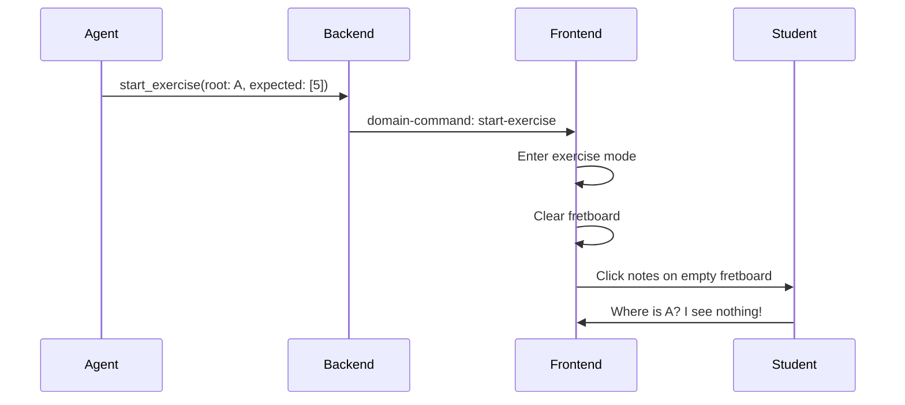
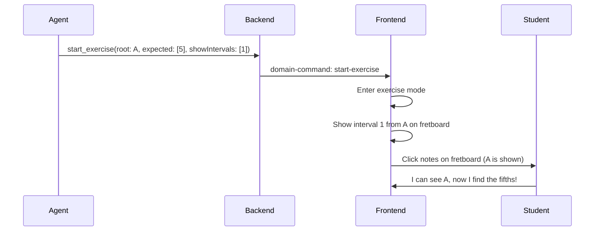

# Exercise Initial State — Plan

## Problem

When the agent starts an exercise during a lesson, it cannot initialize the fretboard with any visible state. For example, when the agent says "Find all fifths from A" and calls `start_exercise`, the fretboard enters clickable exercise mode but **does not show the root note A**. The student is asked to find intervals relative to A, but has no visual reference on the fretboard.

**User report:** "Agent podczas prowadzenia lekcji nie może nic przesłać do gryfu w trybie ćwiczenia. Każe mi znaleźć kwintę od A, ale nie zaznacza mi A na wstępie."

## Root Cause

The [`StartExerciseCommand`](src/types/contract.ts:64) interface has `rootNote` and `expectedIntervals` fields, but these are used **only for validation** — they tell the frontend what answers to expect, not what to display. There is no mechanism to tell the frontend "show these intervals on the fretboard when the exercise starts."

```typescript
// Current — no way to specify what to display
export interface StartExerciseCommand {
  type: 'start-exercise';
  question: string;
  rootNote: string;           // for validation only
  expectedIntervals: string[]; // for validation only
  fretRange?: { min: number; max: number };
  enabledStrings?: boolean[];
}
```

The agent prompt ([`src/types/prompts.ts`](src/types/prompts.ts:227)) instructs the agent to call `start_exercise` then `wait_for_user`, but doesn't guide it to first show the root note. Even if the agent called `show_interval` before `start_exercise`, the frontend might clear the fretboard when entering exercise mode.

## Solution

Add an optional `showIntervals` field to `StartExerciseCommand` that tells the frontend which intervals to display on the fretboard when the exercise starts.

### Why this approach?

| Criteria | `showIntervals` field | Call `show_interval` before `start_exercise` |
|----------|----------------------|----------------------------------------------|
| **Atomicity** | Exercise starts with correct state in one command | Two commands, race condition possible |
| **Frontend complexity** | Single field to handle | Must preserve state across mode transitions |
| **Backward compat** | Optional field, no breaking changes | Works if frontend preserves state |
| **Agent control** | Explicit — agent says what to show | Implicit — depends on frontend behavior |
| **Reliability** | Always works | Depends on frontend preserving state |

### Example usage

The agent calls:

```
start_exercise({
  question: "Znajdź wszystkie kwinty względem A",
  rootNote: "A",
  expectedIntervals: ["5"],
  showIntervals: ["1"],  // ← NEW: show root note on fretboard
  fretRange: { min: 0, max: 12 }
})
```

The frontend:
1. Enters exercise mode (clickable fretboard)
2. Displays the root note A on the fretboard (marking interval "1" positions)
3. Waits for the student to click notes and press "Sprawdź"

### More examples

| Scenario | `rootNote` | `expectedIntervals` | `showIntervals` | Effect |
|----------|-----------|---------------------|-----------------|--------|
| Find fifths from A | `A` | `["5"]` | `["1"]` | Shows A, student finds 5 |
| Find major third from C | `C` | `["3"]` | `["1"]` | Shows C, student finds 3 |
| Find minor third from D | `D` | `["b3"]` | `["1"]` | Shows D, student finds b3 |
| Find all notes of C major chord | `C` | `["1","3","5"]` | `["1"]` | Shows C, student finds 3 and 5 |
| Find b3 and b7 from A (advanced) | `A` | `["b3","b7"]` | `["1","5"]` | Shows A and 5, student finds b3 and b7 |

## Changes Required

### 1. Backend — [`src/types/contract.ts`](src/types/contract.ts)

Add `showIntervals` to `StartExerciseCommand`:

```typescript
export interface StartExerciseCommand {
  type: 'start-exercise';
  question: string;
  rootNote: string;
  expectedIntervals: string[];
  showIntervals?: string[];  // ← NEW: intervals to display on fretboard
  fretRange?: { min: number; max: number };
  enabledStrings?: boolean[];
}
```

### 2. Backend — [`src/tools/domain-tools.ts`](src/tools/domain-tools.ts)

Add `showIntervals` to `startExerciseSchema`:

```typescript
const startExerciseSchema = z.object({
  question: z.string().describe("Pytanie do użytkownika, np. 'Znajdź wszystkie kwinty względem A'"),
  rootNote: z.string().describe("Nuta podstawowa, np. 'A', 'C'"),
  expectedIntervals: z.array(z.string()).describe("Oczekiwane interwały, np. ['5'], ['1', 'b3']"),
  showIntervals: z.array(z.string()).optional().describe(
    "Interwały do wyświetlenia na gryfie na początku ćwiczenia. " +
    "Np. ['1'] pokaże nutę podstawową, ['1','5'] pokaże nutę podstawową i kwintę. " +
    "Użyj gdy uczeń potrzebuje wizualnego punktu odniesienia przed rozpoczęciem."
  ),
  fretRange: z.object({ ... }).optional(),
  enabledStrings: z.array(z.boolean()).length(6).optional(),
});
```

Also update the tool handler to pass `showIntervals` through:

```typescript
tool(
  async (input: StartExerciseInput) => {
    const command: DomainCommand = {
      type: "start-exercise",
      question: input.question,
      rootNote: input.rootNote,
      expectedIntervals: input.expectedIntervals,
      showIntervals: input.showIntervals,  // ← NEW
      fretRange: input.fretRange,
      enabledStrings: input.enabledStrings,
    };
    await ctx.executeCommand(command);
    // ...
  },
  // ...
);
```

### 3. Backend — [`src/types/prompts.ts`](src/types/prompts.ts)

Update section 8 (Ćwiczenia i wynik) to guide the agent to use `showIntervals`:

**Current (line 227-241):**
```
Kiedy uczeń ma wskazać dźwięki na gryfie:
1. Krótko wyjaśnij zadanie.
2. Wywołaj start_exercise.
3. Wywołaj wait_for_user, aby zaczekać na wykonanie zadania.
```

**After:**
```
Kiedy uczeń ma wskazać dźwięki na gryfie:
1. Krótko wyjaśnij zadanie.
2. Wywołaj start_exercise z parametrem showIntervals, aby pokazać
   punkt odniesienia na gryfie. Np. showIntervals: ['1'] pokaże
   nutę podstawową, showIntervals: ['1','5'] pokaże root i kwintę.
3. Wywołaj wait_for_user, aby zaczekać na wykonanie zadania.

Zawsze używaj showIntervals, żeby uczeń widział punkt wyjścia
do ćwiczenia. Nie każ mu zgadywać, gdzie jest nuta podstawowa.
```

Also update the Domain Tools description for `start_exercise` (line 319-320):

**Current:**
```
description: "Rozpoczyna ćwiczenie w trybie lekcji. Aktywuje klikalny tryb na gryfie..."
```

**After:**
```
description: "Rozpoczyna ćwiczenie w trybie lekcji. Aktywuje klikalny tryb na gryfie — użytkownik może zaznaczać nuty. Użyj showIntervals, aby pokazać punkt odniesienia (np. showIntervals: ['1'] pokaże nutę podstawową). Gdy skończy, kliknie Sprawdź. Użyj gdy prowadzisz lekcję i chcesz zadać pytanie typu 'znajdź wszystkie kwinty względem A'."
```

### 4. Frontend — guitar-neck-ui (separate repo)

The frontend needs to handle `showIntervals` when processing the `start-exercise` domain command:

1. Parse `showIntervals` from the command payload
2. When entering exercise mode, display the specified intervals on the fretboard:
   - Use the same rendering logic as `show_interval` command
   - Mark the positions with the appropriate interval colors
   - These marks should be visually distinct from the student's selections (e.g., slightly dimmer or with a different border)
3. The pre-marked notes should NOT be selectable by the student (they're reference points)
4. When the student submits, the pre-marked notes should not be counted in the answer

**Suggested frontend implementation:**

```typescript
// In the domain command handler
case 'start-exercise':
  this.exerciseMode = true;
  this.exerciseTask = {
    question: command.question,
    rootNote: command.rootNote,
    expectedIntervals: command.expectedIntervals,
  };
  
  // NEW: Show reference intervals on the fretboard
  if (command.showIntervals && command.showIntervals.length > 0) {
    this.showReferenceIntervals(command.rootNote, command.showIntervals);
  }
  break;
```

The `showReferenceIntervals` method would:
- Calculate positions for each interval from the root note
- Display them on the fretboard with a "reference" visual style
- Mark them as non-interactive (student can't click them)

### 5. Tests — [`src/tools/domain-tools.spec.ts`](src/tools/domain-tools.spec.ts)

Add test cases for the new `showIntervals` field:

```typescript
describe("start_exercise with showIntervals", () => {
  it("przekazuje showIntervals w commandzie", async () => {
    const ctx = createMockContext();
    const tools = createDomainTools(ctx);
    const startExerciseTool = tools[8]; // index may vary

    await startExerciseTool.invoke({
      question: "Znajdź kwinty od A",
      rootNote: "A",
      expectedIntervals: ["5"],
      showIntervals: ["1"],
    });

    expect(ctx.emitted).toHaveLength(1);
    expect(ctx.emitted[0]).toMatchObject({
      type: "start-exercise",
      showIntervals: ["1"],
    });
  });

  it("działa bez showIntervals (backward compat)", async () => {
    const ctx = createMockContext();
    const tools = createDomainTools(ctx);
    const startExerciseTool = tools[8];

    await startExerciseTool.invoke({
      question: "Znajdź kwinty od A",
      rootNote: "A",
      expectedIntervals: ["5"],
    });

    expect(ctx.emitted).toHaveLength(1);
    expect(ctx.emitted[0].showIntervals).toBeUndefined();
  });
});
```

## Execution Order

| # | Step | Files | Description |
|---|------|-------|-------------|
| 1 | Update contract | `src/types/contract.ts` | Add `showIntervals` to `StartExerciseCommand` |
| 2 | Update domain tools | `src/tools/domain-tools.ts` | Add `showIntervals` to schema and handler |
| 3 | Update prompts | `src/types/prompts.ts` | Guide agent to use `showIntervals` |
| 4 | Update tests | `src/tools/domain-tools.spec.ts` | Add test cases for `showIntervals` |
| 5 | Run tests | — | `npm test` — verify all pass |
| 6 | Frontend | guitar-neck-ui | Handle `showIntervals` in exercise mode |

## Mermaid: Exercise Flow

### Before (current)


### After (new)


## Risk Assessment

| Risk | Impact | Mitigation |
|------|--------|------------|
| **showIntervals ignored by frontend** | Medium — exercise works but without reference | Document as required frontend change; add fallback (frontend shows root note by default if showIntervals is present) |
| **Agent doesn't use showIntervals** | Low — prompt guides it; existing behavior preserved | Prompt update is sufficient; can add examples |
| **showIntervals conflicts with exercise validation** | Low — showIntervals is display-only, not validation | Document that showIntervals is for display only; expectedIntervals still drives validation |
| **Frontend complexity** | Low-medium — needs new rendering mode for reference notes | Reference notes reuse existing interval display logic with a visual distinction |

## Future Considerations

- **Marker display mode**: Consider adding `markerDisplayMode` to `StartExerciseCommand` so the agent can control whether reference notes show as interval colors, note names, or neutral dots.
- **Pre-selected notes**: For advanced exercises, consider `preselectNotes` to pre-fill some answers (e.g., "I'll show you the root and fifth, you find the third").
- **Multiple reference patterns**: For complex exercises, consider `showPattern` as an alternative to `showIntervals` (e.g., show a full scale as reference).