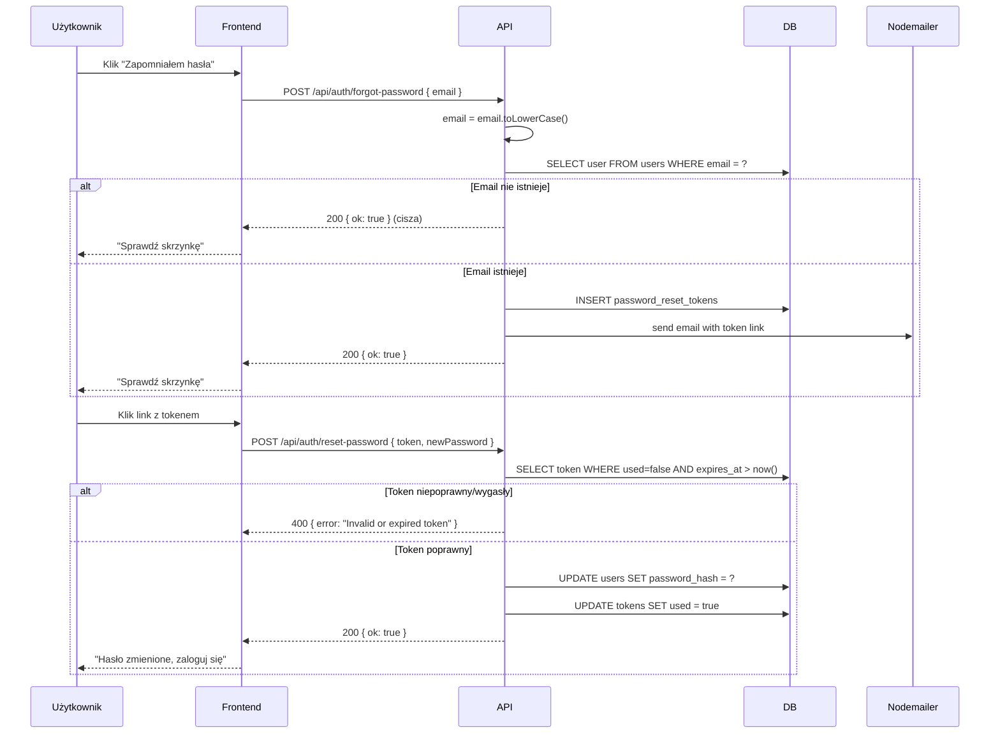

# Plan: Zmiana hasła + reset hasła + case-insensitive email

## Problem

1. **Brak zmiany hasła** — nie ma endpointu do zmiany hasła przez zalogowanego użytkownika.
2. **Brak resetowania hasła** — nie ma sposobu na odzyskanie konta po zapomnieniu hasła.
3. **Email case-sensitive** — rejestracja i logowanie używają `eq(users.email, email)` który w PostgreSQL jest case-sensitive. "User@example.com" i "user@example.com" to dwa różne konta.

## Rozwiązanie

### 1. Normalizacja emaila — `toLowerCase()`

Normalizujemy email do **lower case** przy zapisie i przy wyszukiwaniu. Nie wymaga migracji DB — UNIQUE constraint na `email` już istnieje.

**Miejsca do zmiany w [`src/auth/routes.ts`](src/auth/routes.ts):**

| Linia | Kod | Zamienić na |
|-------|-----|-------------|
| ~34 | `eq(users.email, email)` | `eq(users.email, email.toLowerCase())` |
| ~44 | `values({ email, passwordHash })` | `values({ email: email.toLowerCase(), passwordHash })` |
| ~86 | `eq(users.email, email)` | `eq(users.email, email.toLowerCase())` |

### 2. Endpoint `PUT /api/auth/password` — zmiana hasła (zalogowany użytkownik)

W [`src/auth/routes.ts`](src/auth/routes.ts):

```
PUT /api/auth/password
Auth: wymaga sesji (requireAuth)
Body: { currentPassword: string, newPassword: string }
Response 200: { ok: true }
Response 400: { error: "..." } — brakujące pola
Response 401: { error: "Current password is incorrect" }
```

**Logika:**
1. `requireAuth` — sprawdza sesję
2. Pobiera `password_hash` z DB dla `req.session.userId`
3. `bcrypt.compare(currentPassword, hash)` — weryfikacja
4. `bcrypt.hash(newPassword, 12)` — hashowanie nowego
5. `UPDATE users SET password_hash = ? WHERE id = ?`
6. Sesja pozostaje aktywna

### 3. Resetowanie hasła — `nodemailer` + tabela tokenów

#### Nowa zależność
- `nodemailer` — solidna npm paczka do wysyłania emaili przez SMTP

#### Nowa tabela: `password_reset_tokens`

```sql
CREATE TABLE password_reset_tokens (
  id uuid PRIMARY KEY DEFAULT gen_random_uuid(),
  user_id uuid NOT NULL REFERENCES users(id) ON DELETE CASCADE,
  token varchar(255) NOT NULL UNIQUE,
  expires_at timestamp NOT NULL,
  used boolean DEFAULT false NOT NULL,
  created_at timestamp DEFAULT now() NOT NULL
);
```

Nowy plik: [`src/db/schema/password_reset_tokens.ts`](src/db/schema/password_reset_tokens.ts)

#### Nowe endpointy w [`src/auth/routes.ts`](src/auth/routes.ts):

**`POST /api/auth/forgot-password`**
```
Body: { email: string }
Response 200: { ok: true }  (zawsze — nawet jeśli email nie istnieje, bezpieczeństwo)
```
Logika:
1. `email.toLowerCase()` — normalizacja
2. Szuka użytkownika po emailu
3. Jeśli istnieje: generuje token (uuid), zapisuje do `password_reset_tokens`, wysyła email przez nodemailer
4. Jeśli nie istnieje: nic nie robi (ale zwraca 200 — ochrona przed enumeracją emaili)

**`POST /api/auth/reset-password`**
```
Body: { token: string, newPassword: string }
Response 200: { ok: true }
Response 400: { error: "..." } — brakujące pola / token wygasł / token już użyty
Response 404: { error: "Invalid or expired token" }
```
Logika:
1. Szuka tokena w DB po `token` i `used = false` i `expires_at > now()`
2. Jeśli znaleziony: `bcrypt.hash(newPassword, 12)`, aktualizuje `password_hash`, oznacza token jako `used = true`
3. Niszczy wszystkie sesje użytkownika (opcjonalnie — dla bezpieczeństwa)

#### Zmienne środowiskowe (`.env`)

```
SMTP_HOST=smtp.gmail.com
SMTP_PORT=587
SMTP_USER=your-email@gmail.com
SMTP_PASS=your-app-password
SMTP_FROM=noreply@gitarneck.pl
APP_URL=http://localhost:4200
```

#### Nowy plik: [`src/email/service.ts`](src/email/service.ts)

```typescript
// Serwis do wysyłania emaili przez nodemailer
export const emailService = {
  async sendPasswordReset(email: string, token: string): Promise<void> {
    const resetUrl = `${process.env.APP_URL}/reset-password?token=${token}`;
    // wysyła email z linkiem resetującym
  }
}
```

### 4. Testy

**Nowy plik: [`src/auth/routes.spec.ts`](src/auth/routes.spec.ts)**

**Case-insensitive email:**
- Rejestracja "Test@Example.com" → zapisany jako "test@example.com"
- Logowanie "test@example.com" → OK
- Logowanie "TEST@EXAMPLE.COM" → OK
- Rejestracja duplikatu z innym case'm → 409

**Zmiana hasła:**
- Z poprawnym `currentPassword` → 200
- Z błędnym `currentPassword` → 401
- Bez autoryzacji → 401
- Po zmianie: stare hasło nie działa, nowe działa

**Reset hasła:**
- `POST /api/auth/forgot-password` z istniejącym emailem → 200 + email wysłany (mock nodemailer)
- `POST /api/auth/forgot-password` z nieistniejącym emailem → 200 (brak emaila)
- `POST /api/auth/reset-password` z poprawnym tokenem → 200
- `POST /api/auth/reset-password` z wygasłym tokenem → 400
- `POST /api/auth/reset-password` z już użytym tokenem → 400

## Diagram przepływu — reset hasła



## Kolejność zadań

| # | Zadanie | Pliki |
|---|---------|-------|
| 1 | Normalizacja email w rejestracji i loginie | [`src/auth/routes.ts`](src/auth/routes.ts) |
| 2 | Endpoint `PUT /api/auth/password` — zmiana hasła | [`src/auth/routes.ts`](src/auth/routes.ts) |
| 3 | Instalacja `nodemailer` + nowa tabela `password_reset_tokens` | `package.json`, [`src/db/schema/password_reset_tokens.ts`](src/db/schema/password_reset_tokens.ts) |
| 4 | Serwis emailowy + endpointy `forgot-password` i `reset-password` | [`src/email/service.ts`](src/email/service.ts), [`src/auth/routes.ts`](src/auth/routes.ts) |
| 5 | Testy | [`src/auth/routes.spec.ts`](src/auth/routes.spec.ts) |
| 6 | Aktualizacja CHANGELOG.md | [`CHANGELOG.md`](CHANGELOG.md) |

## Pliki do zmiany (podsumowanie)

| Plik | Operacja |
|------|----------|
| [`package.json`](package.json) | `npm install nodemailer` + `npm install -D @types/nodemailer` |
| [`src/auth/routes.ts`](src/auth/routes.ts) | Modyfikacja: normalizacja email (3 miejsca) + nowe endpointy: `PUT /password`, `POST /forgot-password`, `POST /reset-password` |
| [`src/db/schema/password_reset_tokens.ts`](src/db/schema/password_reset_tokens.ts) | Nowy plik: schema Drizzle dla tabeli tokenów |
| [`src/db/schema/index.ts`](src/db/schema/index.ts) | Eksport nowej schemy |
| [`src/email/service.ts`](src/email/service.ts) | Nowy plik: serwis emailowy z nodemailer |
| [`src/auth/routes.spec.ts`](src/auth/routes.spec.ts) | Nowy plik: testy |
| [`.env`](.env) | Nowe zmienne: SMTP_*, APP_URL |
| [`CHANGELOG.md`](CHANGELOG.md) | Wpisać zrealizowane zadanie |