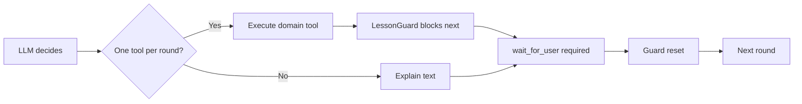
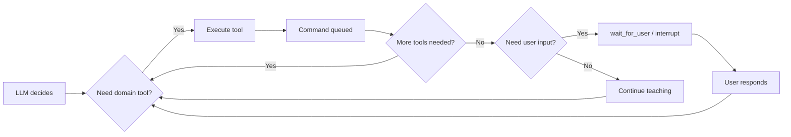
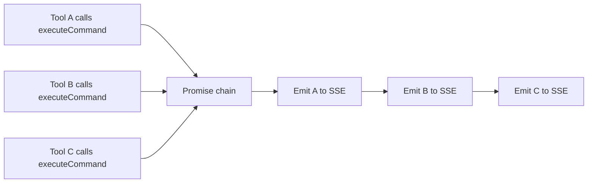

# Refactor Lesson Execution — Plan

## Overview

Remove the `LessonGuard` one-command-per-round restriction, enable multiple sequential domain commands in lesson mode, add interaction density configuration, and inject density value into the existing teacher prompt.

## Files to Delete

| File | Reason |
|------|--------|
| `src/lesson-guard.ts` | Entire guard mechanism removed |
| `src/lesson-guard.spec.ts` | Guard tests removed |

## Files to Modify

| File | Changes |
|------|---------|
| `src/agent.ts` | Remove `LessonGuard` import/usage; accept `interactionDensity` config; inject density into system prompt |
| `src/tools/domain-tools.ts` | Remove all `lessonGuard` references; add command sequencer; remove `guard` param from `createWaitForUserTool` |
| `src/tools/domain-tools.spec.ts` | Remove guard tests; add multi-command, ordering, snapshot-semantics tests |
| `src/routes/chat.ts` | Add command sequencer in `emitCommand`; pass `interactionDensity` to agent config |
| `src/index.ts` | Validate `LESSON_INTERACTION_DENSITY` at startup |

## No changes to

| File | Reason |
|------|--------|
| `src/types/prompts.ts` | User already replaced `LESSON_SYSTEM_PROMPT` with new pedagogical prompt. The prompt uses `{{interactionDensity}}` placeholder — injection happens at runtime in `agent.ts`. |

## Detailed Changes

### 1. Remove LessonGuard — `src/lesson-guard.ts` (DELETE)

Delete the entire file. No replacement.

### 2. Remove LessonGuard — `src/agent.ts`

**Current:**
```typescript
import { LessonGuard } from "./lesson-guard.js";
// ...
const guard = lessonMode ? new LessonGuard() : undefined;
const domainTools = createDomainTools({
  domainState: ctx.domainState,
  emitCommand: ctx.emitCommand,
  lessonGuard: guard,
});
// ...
tools: lessonMode
  ? [...domainTools, createWaitForUserTool(guard)]
  : domainTools,
```

**After:**
```typescript
// No LessonGuard import
// No guard creation
const domainTools = createDomainTools({
  domainState: ctx.domainState,
  emitCommand: ctx.emitCommand,
});
// ...
tools: lessonMode
  ? [...domainTools, createWaitForUserTool()]
  : domainTools,
```

Also add `interactionDensity` to the `AgentConfig` interface. When building the system prompt for lesson mode, replace `{{interactionDensity}}` with the configured value:

```typescript
const systemPrompt = lessonMode
  ? LESSON_SYSTEM_PROMPT.replace("{{interactionDensity}}", config.interactionDensity)
  : BASE_SYSTEM_PROMPT;
```

### 3. Remove LessonGuard — `src/tools/domain-tools.ts`

**Changes:**
- Remove `import { LessonGuard } from "../lesson-guard"`;
- Remove `lessonGuard?: LessonGuard` from `ToolContext` interface;
- Remove `const blocked = ctx.lessonGuard?.checkCommand()` from all 9 domain command tools;
- Remove `const blocked = ctx.lessonGuard?.checkQuery()` from both query tools (`get_current_view`, `get_exercise_result`);
- Remove `guard?: LessonGuard` parameter from `createWaitForUserTool`;
- Remove `guard?.reset()` call inside `wait_for_user` handler.

**Add command sequencer:**

The `ToolContext` interface gains an `executeCommand` function that serializes domain command emissions:

```typescript
interface ToolContext {
  domainState: DomainState;
  emitCommand: (command: DomainCommand) => void;
  executeCommand: (command: DomainCommand) => Promise<void>;
}
```

Each domain tool calls `await ctx.executeCommand(command)` instead of `ctx.emitCommand(command)`. The sequencer is created in `chat.ts` and passed via the context.

**Why a sequencer?** When the LLM calls multiple tools in parallel (supported by LangGraph/deepagents), concurrent `emitCommand` calls would write to the SSE stream in non-deterministic order. The sequencer chains emissions so they happen one-at-a-time, preserving the order the LLM intended.

### 4. Update `wait_for_user` — `src/tools/domain-tools.ts`

**Current:**
```typescript
export function createWaitForUserTool(guard?: LessonGuard) {
  return tool(
    async ({ prompt }) => {
      guard?.reset();
      return interrupt({ prompt });
    },
    // ...
  );
}
```

**After:**
```typescript
export function createWaitForUserTool() {
  return tool(
    async ({ prompt }) => {
      return interrupt({ prompt });
    },
    // ...
  );
}
```

No guard to reset. `interrupt()` is still the native LangGraph mechanism.

### 5. Add command sequencer — `src/routes/chat.ts`

**Current:**
```typescript
const ctx: AgentRunContext = {
  domainState: resolvedDomainState,
  emitCommand: (command) => {
    emit({ type: "domain-command", command });
  },
};
```

**After:**
```typescript
// Command sequencer — ensures deterministic ordering of domain commands
let commandQueue: Promise<void> = Promise.resolve();

const executeCommand = async (command: DomainCommand) => {
  await (commandQueue = commandQueue.then(() => {
    emit({ type: "domain-command", command });
  }));
};

const ctx: AgentRunContext = {
  domainState: resolvedDomainState,
  emitCommand: (command) => {
    emit({ type: "domain-command", command });
  },
  executeCommand,
};
```

Also update `AgentRunContext` interface in `agent.ts` to include `executeCommand`.

### 6. Interaction Density — `src/index.ts` + `src/agent.ts`

**Validation at startup** (`src/index.ts`):

```typescript
const VALID_DENSITIES = ["frequent", "balanced", "mostly-teach"] as const;
const interactionDensity = process.env.LESSON_INTERACTION_DENSITY ?? "balanced";
if (!VALID_DENSITIES.includes(interactionDensity)) {
  console.error(`Invalid LESSON_INTERACTION_DENSITY: "${interactionDensity}". Must be one of: ${VALID_DENSITIES.join(", ")}`);
  process.exit(1);
}
```

**Pass to agent config** — add `interactionDensity` to `AgentConfig` and use it when building the system prompt.

### 7. Update tests — `src/tools/domain-tools.spec.ts`

**Remove:**
- All tests in `"domain command tools — guard integration"` describe block
- All tests in `"query tools — guard integration"` describe block
- The `wait_for_user` guard reset test

**Keep:**
- `"bez guarda (normal chat)"` describe block — these tests already verify multi-command behavior without a guard

**Add new test blocks:**

```
describe("multiple domain commands", () => {
  it("pozwala na kilka kolejnych commandów", async () => { ... })
  it("zachowuje kolejność emisji przy sekwencyjnych wywołaniach", async () => { ... })
  it("emituje command przez executeCommand", async () => { ... })
})

describe("query tools — snapshot semantics", () => {
  it("get_current_view zwraca stan sprzed requestu", async () => { ... })
  it("get_current_view działa po command — brak blokady", async () => { ... })
  it("get_exercise_result działa po command — brak blokady", async () => { ... })
})

describe("wait_for_user", () => {
  it("wywołuje interrupt z promptem", async () => { ... })
})
```

### 8. Exercise flow — no changes needed

The existing flow already works:
1. Agent calls `start_exercise` → emits `DomainCommand`
2. Angular shows exercise, user interacts
3. Angular submits result via `POST /api/progress/exercises/result`
4. On next request, `domainState` includes `lastExerciseResult`
5. Agent calls `get_exercise_result` to read it

The only change: remove the guard restriction that prevented `get_exercise_result` after a command.

## Streaming Limitations

**Current streaming behavior** (`src/routes/chat.ts`):
- All tool calls execute during the LLM run
- Text tokens are collected and emitted as a single `token` event at the end
- Domain commands are emitted as they happen via `emitCommand`

**Limitation:** Text explanation and domain commands are not interleaved in the stream. The frontend receives:
1. `domain-command` events (as they happen)
2. A single `token` event with all text
3. `interrupt` / `done`

This means the frontend cannot display synchronized explanation + demonstration. The spec acknowledges this: "Jeżeli aktualny streaming nie zapewnia jednoznacznej synchronizacji wyjaśnienia z demonstracją, wskaż ograniczenie i minimalny potrzebny kontrakt."

**Minimal contract for future synchronization:**
- Stream text tokens incrementally (not batched)
- Interleave `token` and `domain-command` events in chronological order
- Frontend processes events in order, applying commands as they arrive alongside text

This is NOT part of this refactor — it's a separate streaming protocol change.

## Test Plan

### Acceptance Tests

| # | Scenario | Steps | Expected |
|---|----------|-------|----------|
| 1 | Multiple domain commands in lesson mode | Call `show_pattern` then `show_interval` in same round | Both execute, both emit, no error |
| 2 | Correct emission order with parallel calls | LLM calls 2 tools in parallel | Commands emitted in deterministic order |
| 3 | Query before domain command | `get_current_view` then `show_pattern` | Query returns state, command executes |
| 4 | Query after domain command — no false confirmation | `show_pattern` then `get_current_view` | Query returns OLD snapshot (not updated) |
| 5 | Demo → exercise → wait_for_user | Multiple demos, `start_exercise`, `wait_for_user` | All demos execute, exercise starts, interrupt fires |
| 6 | Submit → resume → get_exercise_result | User submits exercise, agent resumes, calls `get_exercise_result` | Returns exercise result from snapshot |
| 7 | Native interrupt and resume | `wait_for_user` interrupts, `Command({ resume })` resumes | Same checkpoint, state preserved |
| 8 | Different interactionDensity values | Set `frequent`, `balanced`, `mostly-teach` | Prompt reflects correct density |
| 9 | No regression in normal mode | Normal chat with multiple tools | All tools work, no guard interference |

### Unit Tests to Update

| File | Action |
|------|--------|
| `src/lesson-guard.spec.ts` | DELETE |
| `src/tools/domain-tools.spec.ts` | Remove guard tests, add multi-command and snapshot tests |

## Execution Order

1. **Delete** `src/lesson-guard.ts` and `src/lesson-guard.spec.ts`
2. **Update** `src/tools/domain-tools.ts` — remove guard, add `executeCommand` to context, update all tools
3. **Update** `src/agent.ts` — remove guard, update `AgentRunContext` interface, add `interactionDensity` config, inject density into prompt
4. **Update** `src/routes/chat.ts` — add command sequencer, pass `executeCommand` in context, pass `interactionDensity`
5. **Update** `src/index.ts` — validate `LESSON_INTERACTION_DENSITY`
6. **Update** `src/tools/domain-tools.spec.ts` — rewrite tests
7. **Run** `npm test` — verify all tests pass
8. **Verify** no regressions in normal mode

## Mermaid: Before/After Flow

### Before (current)


### After (new)


### Command Sequencer Detail


## Risk Assessment

| Risk | Impact | Mitigation |
|------|--------|------------|
| LLM calls too many tools in one round | Low — LLM is already incentivized to be efficient; no hard limit needed | Trust the prompt; interaction density guides behavior |
| Parallel tool calls cause race conditions | Medium — concurrent `emitCommand` calls | Command sequencer (promise chain) serializes emissions |
| Snapshot semantics confuse LLM | Low — `get_current_view` after command returns old state, which is documented | Clear prompt instruction about snapshot semantics |
| Exercise flow breaks without guard | Low — exercise flow doesn't depend on guard | Existing flow preserved unchanged |
| Normal mode regression | Low — guard was only created in lesson mode | Verify normal mode tests pass |